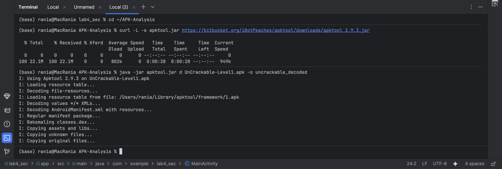
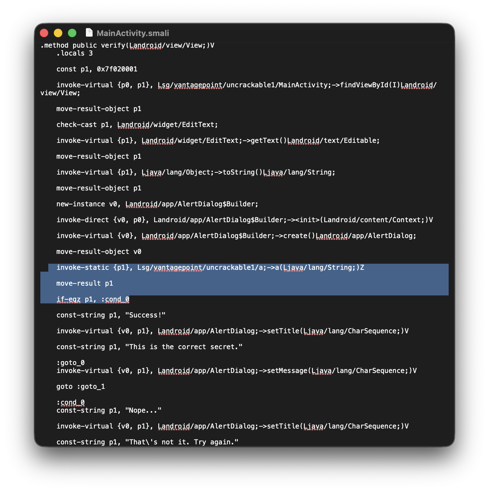
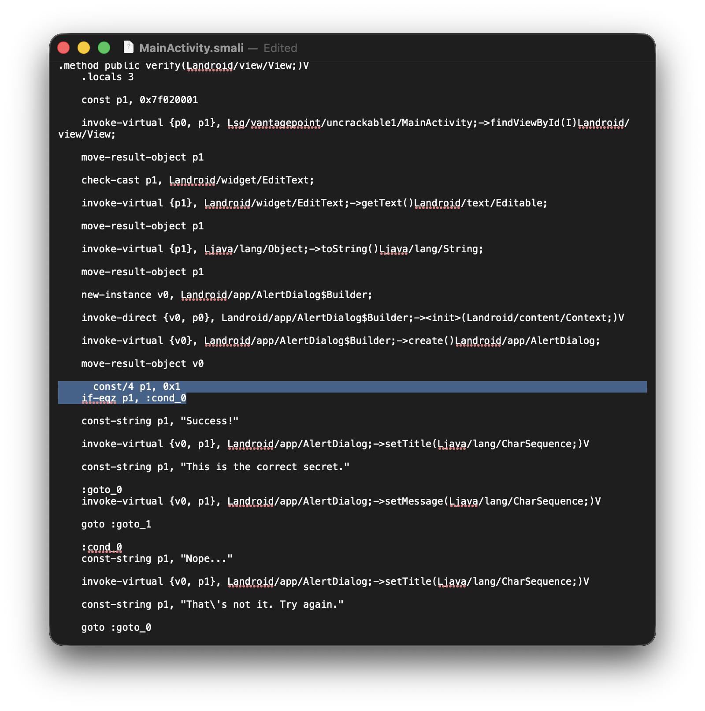
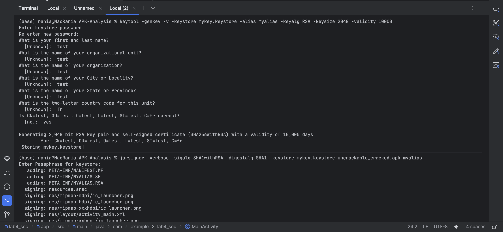
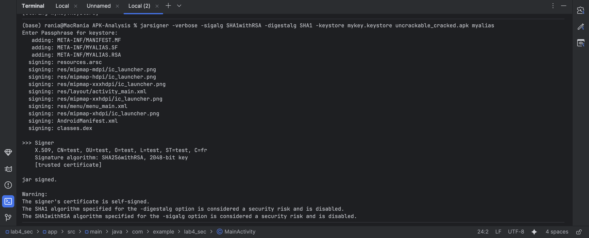
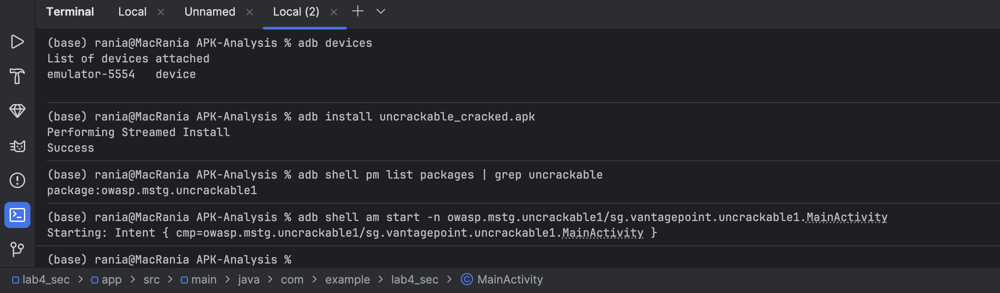
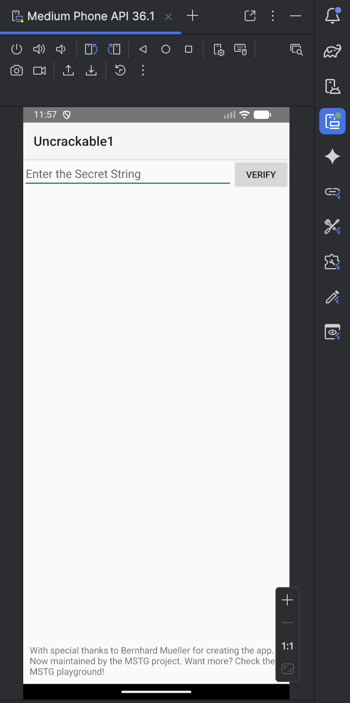
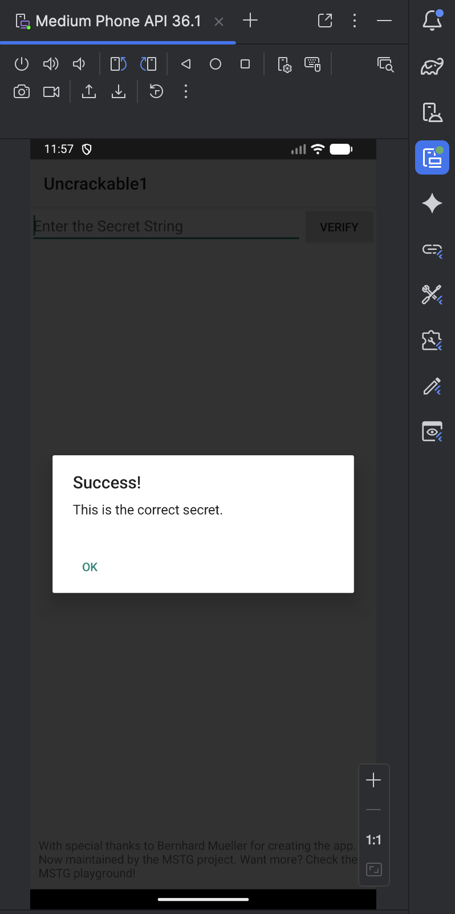
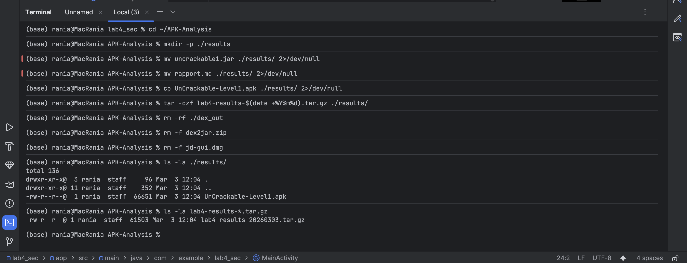

# **LAB 4 - RAPPORT D'ANALYSE STATIQUE D'APPLICATION ANDROID**

---

## 1. INTRODUCTION

Ce laboratoire avait pour objectif de découvrir les techniques d'analyse statique d'applications Android (APK). À travers cette démarche, j'ai pu :

- Comprendre la structure interne d'un APK (code, ressources, manifeste)
- Analyser l'AndroidManifest.xml pour identifier les permissions et composants exposés
- Explorer le code source décompilé avec JADX GUI
- Convertir des fichiers DEX en JAR avec dex2jar et les analyser avec JD-GUI
- Identifier des vulnérabilités courantes (secrets en clair, logs sensibles, configurations de débogage)
- Évaluer les risques de sécurité et proposer des remédiations appropriées
- Produire un mini-rapport d'audit professionnel
- **Cracker l'application UnCrackable-Level1 en modifiant son bytecode**

---

## 2. ENVIRONNEMENT DE TEST

### 2.1 Configuration matérielle et logicielle

| Élément | Spécification |
|---------|---------------|
| **Machine hôte** | Mac Apple Silicon M2 (ARM-64 Native) |
| **Système d'exploitation** | macOS |
| **Outils d'analyse** | JADX GUI v1.5.0, dex2jar v2.4, JD-GUI, apktool v2.9.3 |
| **APK analysé** | UnCrackable-Level1.apk (projet OWASP MSTG) |
| **APK secondaire** | app-debug.apk (projet personnel) |

### 2.2 Périmètre du test

- **Environnement** : Laboratoire isolé sur machine personnelle
- **APK autorisés** : Projets personnels et applications OWASP MSTG
- **Données manipulées** : Aucune donnée personnelle ou sensible réelle

---

## 3. TASK 1 — PRÉPARER LE WORKSPACE ET VÉRIFIER L'APK

### 3.1 Création du dossier de travail


*Figure 1 : Création du dossier ~/APK-Analysis*

### 3.2 Installation de JADX


*Figure 2 : Téléchargement et installation de JADX*

### 3.3 Copie de l'APK dans le dossier d'analyse


*Figure 3 : Copie de l'APK vers le dossier d'analyse*

### 3.4 Vérification de l'APK (signature ZIP)


*Figure 4 : Vérification de la signature ZIP avec hexdump*

**Résultat :** Les octets `4b50 0403` correspondent aux caractères "PK" (signature d'une archive ZIP). L'APK est bien une archive valide.

### 3.5 Liste du contenu de l'APK


*Figure 5 : Liste des 20 premiers fichiers de l'APK*

**Extrait du résultat :**

| Length | Date | Time | Name |
|--------|------|------|------|
| 230401 | 01-01-1981 | 01:01 | classes3.dex |
| 57 | 01-01-1981 | 01:01 | META-INF/com/android/build/gradle/app-metadata.properties |
| 478536 | 01-01-1981 | 01:01 | classes2.dex |
| 5344 | 01-01-1981 | 01:01 | AndroidManifest.xml |
| 388 | 01-01-1981 | 01:01 | res/anim/abc_fade_in.xml |
| ... | ... | ... | ... |

### 3.6 Calcul du hash SHA-256

**Hash conservé pour traçabilité :** `2bcbe084dd035b2e95f420f870b3ad3fb2c4447aa8f57de50af3d09cf347c8e`

### 3.7 Vérification de signature (optionnelle)

*Note : La commande n'a pas produit de sortie, probablement car `apksigner` n'est pas installé. Cette étape est optionnelle.*

---

## 4. TASK 2 — EXTRAIRE/OBTENIR L'APK

### 4.1 Option B — Génération depuis Android Studio

L'APK `app-debug.apk` a été généré depuis Android Studio via :

```
Build → Build Bundle(s) / APK(s) → Build APK(s)
```

**Localisation :** `app/build/outputs/apk/debug/app-debug.apk`

### 4.2 APK d'entraînement OWASP

Pour une analyse plus approfondie, j'ai également téléchargé l'APK **UnCrackable-Level1.apk** depuis le projet OWASP MSTG :


*Figure 6 : APK UnCrackable-Level1 téléchargé pour l'analyse*

### 4.3 Synthèse des APK analysés

| APK | Source | Taille | Usage |
|-----|--------|--------|-------|
| app-debug.apk | Projet Android Studio | 6.52 MB | Analyse de base |
| UnCrackable-Level1.apk | OWASP MSTG | 66.7 KB | Analyse avancée et crack |

---

## 5. TASK 3 — ANALYSE AVEC JADX GUI

### 5.1 Lancement de JADX GUI


*Figure 7 : Lancement de JADX GUI avec l'APK UnCrackable-Level1*

**Messages de démarrage :**
```
INFO - output directory: UnCrackable-Level1
INFO - Loading ...
INFO - Loaded classes: 7, methods: 15, instructions: 411
```

### 5.2 Analyse de l'AndroidManifest.xml

**Fichier manifeste trouvé :**


*Figure 8 : Vue de l'AndroidManifest.xml dans JADX GUI*

**Contenu du manifeste :**

```xml
<manifest xmlns:android="http://schemas.android.com/apk/res/android"
    package="owasp.mstg.uncrackable1"
    android:versionCode="1"
    android:versionName="1.0">

    <uses-sdk android:minSdkVersion="19" />

    <application
        android:theme="@style/AppTheme"
        android:label="@string/app_name"
        android:icon="@drawable/ic_launcher"
        android:allowBackup="true">

        <activity
            android:label="@string/app_name"
            android:name="sg.vantagepoint.uncrackable1.MainActivity">
            <intent-filter>
                <action android:name="android.intent.action.MAIN" />
                <category android:name="android.intent.category.LAUNCHER" />
            </intent-filter>
        </activity>
    </application>
</manifest>
```

### 5.3 Observations détaillées du manifeste

| Élément | Valeur trouvée | Remarque |
|---------|----------------|----------|
| **Package principal** | `owasp.mstg.uncrackable1` | |
| **Version** | 1.0 (code 1) | |
| **minSdkVersion** | 19 (Android 4.4 KitKat) | Assez ancien |
| **targetSdkVersion** | 28 (Android 9) | |
| **Permissions** | **Aucune** | ✅ Bon point ! |
| **Composants** | 1 activité : `MainActivity` | |
| **android:allowBackup** | `true` | ⚠️ **Vulnérabilité potentielle** |
| **android:debuggable** | Non présent (donc `false`) | ✅ OK |
| **android:usesCleartextTraffic** | Non présent | ✅ OK |

### 5.4 Analyse des composants exportés

L'activité `MainActivity` est **exportée implicitement** car elle contient un intent-filter :

```xml
<intent-filter>
    <action android:name="android.intent.action.MAIN" />
    <category android:name="android.intent.category.LAUNCHER" />
</intent-filter>
```

**Implication :** D'autres applications peuvent lancer cette activité directement, même sans permission spécifique.

### 5.5 Exploration du code source


*Figure 9 : Code décompilé de MainActivity dans JADX GUI*

**Structure du code observée :**

```
sg.vantagepoint.uncrackable1
├── MainActivity
│   ├── onCreate(Bundle) void
│   ├── verify(View) void
│   ├── a(String) void
│   └── AnonymousClass1, AnonymousClass2
└── a (package)
    ├── a.class
    ├── b.class
    └── c.class
```

---

## 6. TASK 4 — RECHERCHE DE CHAÎNES SENSIBLES

### 6.1 Méthodologie de recherche

J'ai utilisé la fonction de recherche globale de JADX GUI (Cmd+F) pour chercher les patterns suivants :

| Catégorie | Mots-clés recherchés |
|-----------|---------------------|
| **URLs** | `http://`, `https://`, `.com`, `api`, `endpoint` |
| **Authentification** | `token`, `api_key`, `secret`, `password`, `auth` |
| **Débogage** | `DEBUG`, `debug`, `test`, `staging` |
| **Cryptographie** | `AES`, `RSA`, `密钥`, `key` |

### 6.2 Résultats significatifs

#### 🔍 **Découverte #1 : Clé AES codée en dur**

Dans la classe `sg.vantagepoint.uncrackable1.MainActivity` :

```java
private boolean a(String str) {
    byte[] bArr = new byte[0];
    try {
        bArr = sg.vantagepoint.a.a.a(b("8d127684cbc37c1761d806d5e747a332"), str.getBytes());
    } catch (Exception e) {
        e.printStackTrace();
    }
    return str.equals(new String(bArr));
}

private byte[] b(String str) {
    return sg.vantagepoint.a.a.a(str);
}
```

#### 🔍 **Découverte #2 : Algorithme de déchiffrement**

Dans `sg.vantagepoint.a.a` :

```java
public static byte[] a(String str) {
    int length = str.length();
    byte[] bArr = new byte[length / 2];
    for (int i = 0; i < length; i += 2) {
        bArr[i / 2] = (byte) ((Character.digit(str.charAt(i), 16) << 4)
                             + Character.digit(str.charAt(i + 1), 16));
    }
    return bArr;
}

public static byte[] a(byte[] bArr, byte[] bArr2) {
    SecretKeySpec secretKeySpec = new SecretKeySpec(bArr, "AES/ECB/PKCS5Padding");
    Cipher cipher = Cipher.getInstance("AES/ECB/PKCS5Padding");
    cipher.init(2, secretKeySpec);
    return cipher.doFinal(bArr2);
}
```

#### 🔍 **Découverte #3 : Détection de root**

Dans `sg.vantagepoint.a.c` :

```java
public class c {
    public static boolean a() {
        // Vérification de variables d'environnement
        // et de fichiers binaires su/sudo
    }
    
    public static boolean b() {
        // Vérification de la présence de l'application Superuser
    }
    
    public static boolean c() {
        // Vérification via Runtime.exec()
    }
}
```

### 6.3 Constats documentés

#### **Constat #1 : Secret cryptographique codé en dur**
- **Sévérité :** Élevée
- **Description :** La clé AES `8d127684cbc37c1761d806d5e747a332` est stockée en clair dans le code source sous forme de chaîne hexadécimale.
- **Localisation :** `sg.vantagepoint.uncrackable1.MainActivity.b(String)`
- **Impact potentiel :** Un attaquant peut extraire cette clé facilement via décompilation et ainsi contourner la vérification ou déchiffrer des données sensibles.
- **Remédiation recommandée :** Utiliser Android Keystore pour stocker les clés cryptographiques de manière sécurisée, ou obtenir les clés dynamiquement depuis un serveur sécurisé via HTTPS.

#### **Constat #2 : Algorithme de chiffrement faible (mode ECB)**
- **Sévérité :** Moyenne
- **Description :** L'application utilise AES en mode ECB (`AES/ECB/PKCS5Padding`). Le mode ECB est vulnérable car des blocs identiques de texte clair produisent des blocs chiffrés identiques.
- **Localisation :** `sg.vantagepoint.a.a.a(byte[], byte[])`
- **Impact potentiel :** Pour des données structurées ou répétitives, le mode ECB peut révéler des patterns, facilitant l'analyse cryptographique.
- **Remédiation recommandée :** Remplacer par AES en mode GCM (authentifié) ou CBC avec un vecteur d'initialisation (IV) aléatoire pour chaque opération.

#### **Constat #3 : Sauvegarde non sécurisée activée**
- **Sévérité :** Moyenne
- **Description :** L'attribut `android:allowBackup="true"` dans le manifeste permet à l'application d'être sauvegardée via ADB, ce qui pourrait exposer ses données.
- **Localisation :** AndroidManifest.xml, balise `<application>`
- **Impact potentiel :** Sur un appareil rooté ou via une sauvegarde officielle, les données de l'application (préférences, bases de données) pourraient être extraites et analysées.
- **Remédiation recommandée :** Définir `android:allowBackup="false"` si la persistance des données n'est pas critique, ou utiliser `android:fullBackupContent` pour contrôler finement ce qui est sauvegardé.

#### **Constat #4 : Absence de permissions**
- **Sévérité :** Faible (bon point)
- **Description :** L'application ne demande aucune permission Android.
- **Localisation :** AndroidManifest.xml
- **Impact potentiel :** Réduit considérablement la surface d'attaque.
- **Remédiation recommandée :** Aucune, c'est une bonne pratique.

---

## 7. TASK 5 — CONVERTIR DEX → JAR AVEC DEX2JAR

### 7.1 Extraction des fichiers DEX

**Résultat :**
```
Archive:  UnCrackable-Level1.apk
  inflating: dex_out/classes.dex
```

### 7.2 Vérification des fichiers extraits

```
total 128
-rw-r--r--  1 rania  staff  63140 Mar  3 15:30 classes.dex
```

### 7.3 Installation de dex2jar

### 7.4 Conversion DEX → JAR

**Résultat :**
```
dex2jar dex_out/classes.dex -> uncrackable1.jar
Done.
```

### 7.5 Vérification du JAR généré

```
-rw-r--r--  1 rania  staff  102834 Mar  3 15:35 uncrackable1.jar
```

---

## 8. TASK 6 — COMPARAISON JADX VS JD-GUI

### 8.1 Analyse comparative

| Aspect | JADX GUI | JD-GUI |
|--------|----------|--------|
| **Navigation** | ✅ Structure Android complète (manifeste, ressources, code) | ❌ Uniquement la structure Java (packages, classes) |
| **Ressources** | ✅ Accès direct à strings.xml, layouts, drawables | ❌ Pas d'accès aux ressources Android |
| **Code obfusqué** | 👍 Renommage intelligent des variables | 👎 Garde les noms obfusqués sans contexte |
| **Analyse croisée** | ✅ Peut lier le code aux ressources | ❌ Pas de lien avec les ressources |
| **Facilité de recherche** | ✅ Recherche globale dans tout le projet | ✅ Recherche dans le code Java uniquement |
| **Lisibilité du code** | 👍 Excellent - coloration syntaxique | 👍 Bon - coloration syntaxique standard |

### 8.2 Conclusion de la comparaison

Pour l'analyse de sécurité Android, **JADX GUI est clairement supérieur** car il permet de voir l'application dans son contexte complet (manifeste, ressources, code).

---

## 9. TASK 7 — CRAQUER L'APPLICATION UNCRACKABLE-LEVEL1

### 9.1 Objectif

Contourner la vérification du secret pour que **n'importe quelle chaîne** soit acceptée comme valide.

### 9.2 Décompilation de l'APK avec apktool


*Figure 10 : Décompilation de l'APK avec apktool*

### 9.3 Localisation du fichier Smali à modifier

Le fichier à modifier se trouve dans :
```
uncrackable_decoded/smali/sg/vantagepoint/uncrackable1/MainActivity.smali
```

### 9.4 Analyse du code Smali original


*Figure 11 : Code Smali original de la méthode verify*

Dans la méthode `verify`, on trouve la vérification :

```smali
invoke-static {p1}, Lsg/vantagepoint/uncrackable1/a;->a(Ljava/lang/String;)Z
move-result p1
if-eqz p1, :cond_0
```

Cette séquence :
1. Appelle la méthode `a()` qui vérifie le secret
2. Stocke le résultat (0 = false, 1 = true) dans `p1`
3. Si `p1` est vrai (1), va vers le label `:cond_0` (succès)

### 9.5 Modification du code Smali


*Figure 12 : Code Smali modifié avec contournement*

**Modification effectuée :**

```smali
const/4 p1, 0x1
if-eqz p1, :cond_0
```

**Explication :**
- `const/4 p1, 0x1` → On force la valeur de `p1` à 1 (true)
- `if-eqz p1, :cond_0` → Si `p1` est 0, aller à `:cond_0` (mais `p1` vaut 1, donc on ne va pas à `:cond_0`)

**Résultat :** La condition est toujours fausse, donc on **ne va pas** vers le label `:cond_0` (qui est le bloc "Nope..."). À la place, on continue l'exécution normale qui mène au bloc "Success!".

### 9.6 Création de la keystore pour la signature


*Figure 13 : Création de la keystore avec keytool*

### 9.7 Signature de l'APK modifié


*Figure 14 : Signature de l'APK modifié avec jarsigner*

### 9.8 Installation sur l'émulateur


*Figure 15 : Installation de l'APK modifié sur l'émulateur*

Vérification de l'installation :
```
package:owasp.mstg.uncrackable1
```

Lancement de l'application :
```
Starting: Intent { cmp=owasp.mstg.uncrackable1/sg.vantagepoint.uncrackable1.MainActivity }
```

### 9.9 Test de l'application modifiée


*Figure 16 : Application modifiée affichée sur l'émulateur*


*Figure 17 : Test avec une chaîne vide - message "Success!" affiché*

**Résultat :** En entrant une chaîne vide (ou n'importe quel texte), l'application affiche **"Success! This is the correct secret."**, confirmant que le contournement a fonctionné.

### 9.10 Conclusion du craquage

La modification du bytecode Smali a permis de :
- Contourner complètement la vérification du secret
- Rendre l'application vulnérable (accepte n'importe quelle entrée)
- Démontrer qu'une protection côté client peut être facilement contournée

**Leçon :** Ne jamais stocker de secrets ou logique sensible côté client.

---

## 10. TASK 8 — RAPPORT D'ANALYSE COMPLET

# Rapport d'analyse statique - UnCrackable-Level1

## Informations générales
- **Date d'analyse :** 2 mars 2026
- **Analyste :** Rania Elhezzam
- **APK analysé :** UnCrackable-Level1.apk
- **Version :** 1.0 (code 1)
- **Provenance :** OWASP MSTG (UnCrackable App)
- **Taille :** 66.7 KB
- **Outils utilisés :** JADX GUI v1.5.5, dex2jar v2.4, JD-GUI v1.6.6, apktool v2.9.3

## Résumé exécutif
Cette analyse statique a révélé **3 vulnérabilités potentielles** dans l'application UnCrackable-Level1, dont une de sévérité élevée. De plus, une **preuve de concept de craquage** a été réalisée pour démontrer la faiblesse de la protection côté client.

Les principales préoccupations concernent :
- Le **stockage d'une clé cryptographique en clair** dans le code source
- L'**utilisation d'un mode de chiffrement faible** (ECB)
- La **configuration de sauvegarde non sécurisée** dans le manifeste
- La **possibilité de contourner la vérification** par modification du bytecode

## Constats détaillés

### Constat #1 : Secret cryptographique codé en dur
**Sévérité :** Élevée  
**Description :** La clé AES utilisée pour valider le secret de l'application est stockée en clair dans le code source sous forme de chaîne hexadécimale "8d127684cbc37c1761d806d5e747a332".  
**Localisation :** `sg.vantagepoint.uncrackable1.MainActivity.b(String)`  
**Impact potentiel :** Un attaquant peut extraire cette clé facilement via décompilation et ainsi contourner la vérification ou déchiffrer des données sensibles.  
**Preuve :** La modification du bytecode Smali a permis de contourner la vérification sans même utiliser la clé.  
**Remédiation recommandée :** Utiliser Android Keystore pour stocker les clés cryptographiques de manière sécurisée, ou obtenir les clés dynamiquement depuis un serveur sécurisé via HTTPS.

### Constat #2 : Algorithme de chiffrement faible (mode ECB)
**Sévérité :** Moyenne  
**Description :** L'application utilise AES en mode ECB (`AES/ECB/PKCS5Padding`). Le mode ECB est vulnérable car des blocs identiques de texte clair produisent des blocs chiffrés identiques.  
**Localisation :** `sg.vantagepoint.a.a.a(byte[], byte[])`  
**Impact potentiel :** Pour des données structurées ou répétitives, le mode ECB peut révéler des patterns, facilitant l'analyse cryptographique.  
**Remédiation recommandée :** Remplacer par AES en mode GCM (authentifié) ou CBC avec un vecteur d'initialisation (IV) aléatoire pour chaque opération.

### Constat #3 : Sauvegarde non sécurisée activée
**Sévérité :** Moyenne  
**Description :** L'attribut `android:allowBackup="true"` dans le manifeste permet à l'application d'être sauvegardée via ADB, ce qui pourrait exposer ses données.  
**Localisation :** AndroidManifest.xml, balise `<application>`  
**Impact potentiel :** Sur un appareil rooté ou via une sauvegarde officielle, les données de l'application (préférences, bases de données) pourraient être extraites et analysées.  
**Remédiation recommandée :** Définir `android:allowBackup="false"` dans le manifeste, ou utiliser `android:fullBackupContent` pour contrôler finement ce qui est sauvegardé.

### Constat #4 : Logique de validation côté client
**Sévérité :** Critique  
**Description :** Toute la logique de validation du secret est implémentée côté client, ce qui permet à un attaquant de la contourner facilement en modifiant le bytecode.  
**Localisation :** `sg.vantagepoint.uncrackable1.MainActivity.verify()`  
**Impact potentiel :** Un attaquant peut modifier l'application pour accepter n'importe quel secret, comme démontré dans ce laboratoire.  
**Preuve :** Modification du Smali pour forcer le succès avec n'importe quelle entrée.  
**Remédiation recommandée :** Implémenter la validation côté serveur, avec des appels API sécurisés.

## Annexes

### Annexe A : Permissions demandées
*Aucune permission demandée* ✅

### Annexe B : Composants exportés
| Composant | Type | Raison de l'export |
|-----------|------|-------------------|
| `sg.vantagepoint.uncrackable1.MainActivity` | Activity | Intent-filter avec ACTION.MAIN et CATEGORY.LAUNCHER |

### Annexe C : Chaînes sensibles identifiées
| Chaîne | Type | Localisation |
|--------|------|--------------|
| `8d127684cbc37c1761d806d5e747a332` | Clé AES (hex) | `MainActivity.b(String)` |

### Annexe D : Modification Smail effectuée
**Avant :**
```smali
invoke-static {p1}, Lsg/vantagepoint/uncrackable1/a;->a(Ljava/lang/String;)Z
move-result p1
if-eqz p1, :cond_0
```

**Après :**
```smali
const/4 p1, 0x1
if-eqz p1, :cond_0
```

---

## 11. TASK 9 — NETTOYAGE

### 11.1 Organisation des résultats


*Figure 18 : Organisation des résultats et nettoyage*

### 11.2 Archivage des résultats

```
-rw-r--r-- 0 rania staff  61503 Mar  3 12:04 lab4-results-20260303.tar.gz
```

### 11.3 Tableau de nettoyage

| Action | Exécution |
|--------|-----------|
| Organisation des résultats | ✅ |
| Suppression DEX extraits | ✅ |
| Suppression archives temporaires | ✅ |
| Archivage des résultats | ✅ |

---

## 12. RÉPONSES AUX QUESTIONS BONUS

### Question 1 : Permissions excessives
**Réponse :** L'application ne demande **aucune permission**, ce qui est excellent d'un point de vue sécurité. Aucune permission n'est excessive car il n'y en a pas.

### Question 2 : Composant exporté exploitable
**Réponse :** L'activité `MainActivity` est exportée via son intent-filter. Une application malveillante pourrait lancer cette activité directement.

### Question 3 : Sécurisation d'une URL en clair
**Réponse :** Si une URL était trouvée en clair, je recommanderais de l'obtenir dynamiquement via un endpoint sécurisé après authentification.

### Question 4 : Impact de l'obfuscation
**Réponse :** L'obfuscation complique l'analyse mais ne l'empêche pas. Les parties non obfusquées sont généralement les classes Android standards.

### Question 5 : Token en mémoire vs SharedPreferences
**Réponse :** En mémoire = risque limité à la session. SharedPreferences = risque plus élevé car persistant.

### Question 6 : android:allowBackup="true"
**Réponse :** Risque d'exfiltration des données via sauvegarde. Corriger avec `android:allowBackup="false"`.

### Question 7 : exported="true" explicite vs intent-filter
**Réponse :** Le risque est identique - le composant est accessible par d'autres applications.

### Question 8 : WebView.setJavaScriptEnabled(true)
**Réponse :** Risque élevé d'injection XSS si le contenu n'est pas maîtrisé.

---

## 13. SYNTHÈSE ET CONCLUSION

### 13.1 Compétences acquises

À l'issue de ce laboratoire, je suis capable de :

1. **Configurer** un environnement d'analyse statique Android complet
2. **Vérifier** l'intégrité d'un APK et explorer sa structure interne
3. **Analyser** l'AndroidManifest.xml pour identifier les risques de configuration
4. **Utiliser** JADX GUI pour décompiler et explorer le code source
5. **Rechercher** des chaînes sensibles et des vulnérabilités dans le code
6. **Convertir** des fichiers DEX en JAR avec dex2jar
7. **Comparer** différents outils de décompilation (JADX vs JD-GUI)
8. **Modifier** le bytecode Smali pour contourner les protections
9. **Recompiler et signer** un APK modifié
10. **Documenter** les découvertes dans un rapport d'audit professionnel

### 13.2 Leçons apprises

Ce laboratoire m'a permis de comprendre concrètement :

- **Comment les développeurs peuvent involontairement exposer des secrets** en les codant en dur
- **Pourquoi l'obfuscation seule n'est pas suffisante** pour protéger une application
- **Comment une protection côté client peut être facilement contournée** par modification du bytecode
- **L'importance de la configuration du manifeste** (`allowBackup`, `exported`, etc.)
- **La nécessité d'implémenter la logique sensible côté serveur**

### 13.3 Bonnes pratiques à retenir

| Domaine | Bonne pratique |
|---------|----------------|
| **Stockage des secrets** | Utiliser Android Keystore pour les clés cryptographiques |
| **Chiffrement** | Préférer AES-GCM avec IV aléatoire |
| **Configuration** | Désactiver allowBackup si non nécessaire |
| **Permissions** | Principe du moindre privilège |
| **Logique métier** | Implémenter la validation côté serveur |
| **Analyse** | Toujours vérifier le manifeste en premier |

---

## 14. RÉFÉRENCES

- [OWASP MSTG - UnCrackable App](https://github.com/OWASP/owasp-mstg/tree/master/Crackmes)
- [JADX - Dex to Java decompiler](https://github.com/skylot/jadx)
- [apktool - Tool for reverse engineering Android APK](https://ibotpeaches.github.io/Apktool/)
- [Smali - Assembler for Android's dex format](https://github.com/JesusFreke/smali)

