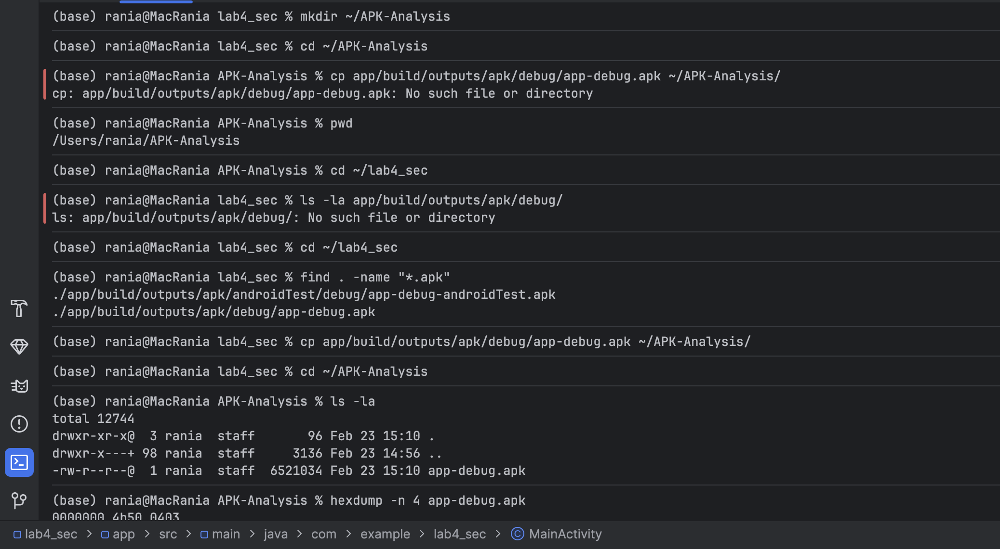
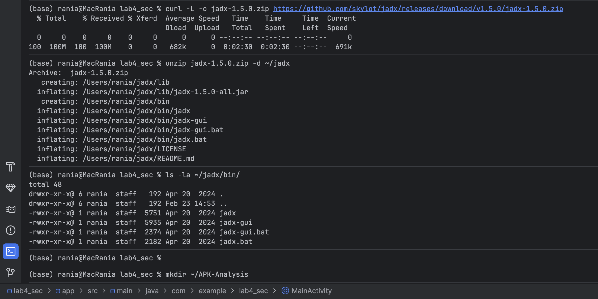
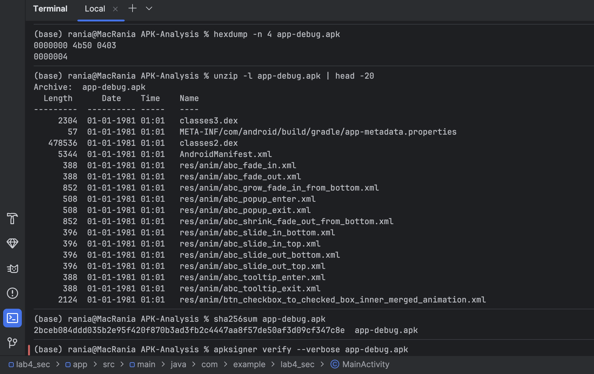
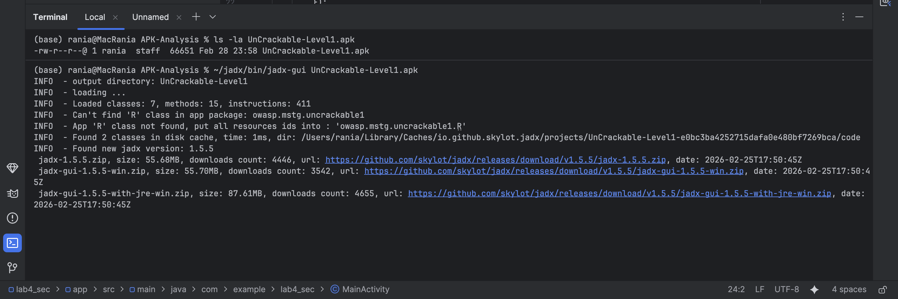
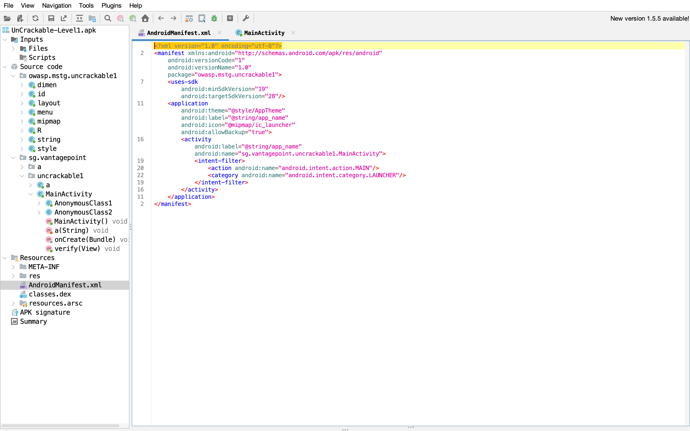
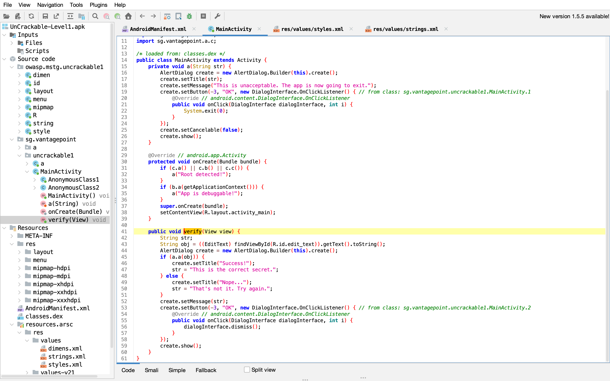

# **LAB 4 - RAPPORT D'ANALYSE STATIQUE D'APPLICATION ANDROID**

---

## 1. INTRODUCTION

Ce laboratoire avait pour objectif de découvrir les techniques d'analyse statique d'applications Android (APK). À travers cette démarche, j'ai pu :

- Comprendre la structure interne d'un APK (code, ressources, manifeste)
- Analyser l'AndroidManifest.xml pour identifier les permissions et composants exposés
- Explorer le code source décompilé avec JADX GUI
- Convertir des fichiers DEX en JAR avec dex2jar et les analyser avec JD-GUI
- Identifier des vulnérabilités courantes (secrets en clair, logs sensibles, configurations de débogage)
- Évaluer les risques de sécurité et proposer des remédiations appropriées
- Produire un mini-rapport d'audit professionnel

---

## 2. ENVIRONNEMENT DE TEST

### 2.1 Configuration matérielle et logicielle

| Élément | Spécification |
|---------|---------------|
| **Machine hôte** | Mac Apple Silicon M2 (ARM-64 Native) |
| **Système d'exploitation** | macOS |
| **Outils d'analyse** | JADX GUI v1.5.0, dex2jar v2.4, JD-GUI |
| **APK analysé** | UnCrackable-Level1.apk (projet OWASP MSTG) |
| **APK secondaire** | app-debug.apk (projet personnel) |

### 2.2 Périmètre du test

- **Environnement** : Laboratoire isolé sur machine personnelle
- **APK autorisés** : Projets personnels et applications OWASP MSTG
- **Données manipulées** : Aucune donnée personnelle ou sensible réelle

---

## 3. TASK 1 — PRÉPARER LE WORKSPACE ET VÉRIFIER L'APK

### 3.1 Création du dossier de travail

```bash
mkdir ~/APK-Analysis
cd ~/APK-Analysis
```


*Figure 1 : Création du dossier ~/APK-Analysis*

### 3.2 Installation de JADX

```bash
curl -L -o jadx-1.5.0.zip https://github.com/skylot/jadx/releases/download/v1.5.0/jadx-1.5.0.zip
unzip jadx-1.5.0.zip -d ~/jadx
ls -la ~/jadx/bin/
```


*Figure 2 : Téléchargement et installation de JADX*

### 3.3 Copie de l'APK dans le dossier d'analyse

```bash
# Recherche de l'APK dans le projet
find . -name "*.apk"
# ./app/build/outputs/apk/androidTest/debug/app-debug-androidTest.apk
# ./app/build/outputs/apk/debug/app-debug.apk

# Copie vers le dossier d'analyse
cp app/build/outputs/apk/debug/app-debug.apk ~/APK-Analysis/
cd ~/APK-Analysis
ls -la
# total 12744
# -rw-r--r--@ 1 rania staff 6521034 app-debug.apk
```


*Figure 3 : Copie de l'APK vers le dossier d'analyse*

### 3.4 Vérification de l'APK (signature ZIP)

```bash
hexdump -n 4 app-debug.apk
# 0000000 4b50 0403
# 0000004
```

**Résultat :** Les octets `4b50 0403` correspondent aux caractères "PK" (signature d'une archive ZIP). L'APK est bien une archive valide.


*Figure 4 : Vérification de la signature ZIP avec hexdump*

### 3.5 Liste du contenu de l'APK

```bash
unzip -l app-debug.apk | head -20
```

**Extrait du résultat :**

| Length | Date | Time | Name |
|--------|------|------|------|
| 230401 | 01-01-1981 | 01:01 | classes3.dex |
| 57 | 01-01-1981 | 01:01 | META-INF/com/android/build/gradle/app-metadata.properties |
| 478536 | 01-01-1981 | 01:01 | classes2.dex |
| 5344 | 01-01-1981 | 01:01 | AndroidManifest.xml |
| 388 | 01-01-1981 | 01:01 | res/anim/abc_fade_in.xml |
| ... | ... | ... | ... |


*Figure 5 : Liste des 20 premiers fichiers de l'APK*

### 3.6 Calcul du hash SHA-256

```bash
sha256sum app-debug.apk
# 2bcbe084dd035b2e95f420f870b3ad3fb2c4447aa8f57de50af3d09cf347c8e  app-debug.apk
```

**Hash conservé pour traçabilité :** `2bcbe084dd035b2e95f420f870b3ad3fb2c4447aa8f57de50af3d09cf347c8e`

### 3.7 Vérification de signature (optionnelle)

```bash
apksigner verify --verbose app-debug.apk
```

*Note : La commande n'a pas produit de sortie, probablement car `apksigner` n'est pas installé. Cette étape est optionnelle.*

---

## 4. TASK 2 — EXTRAIRE/OBTENIR L'APK

### 4.1 Option B — Génération depuis Android Studio

L'APK `app-debug.apk` a été généré depuis Android Studio via :

```
Build → Build Bundle(s) / APK(s) → Build APK(s)
```

**Localisation :** `app/build/outputs/apk/debug/app-debug.apk`

### 4.2 APK d'entraînement OWASP

Pour une analyse plus approfondie, j'ai également téléchargé l'APK **UnCrackable-Level1.apk** depuis le projet OWASP MSTG :

```bash
ls -la UnCrackable-Level1.apk
# -rw-r--r-- 1 rania staff 66651 Feb 28 23:58 UnCrackable-Level1.apk
```


*Figure 6 : APK UnCrackable-Level1 téléchargé pour l'analyse*

### 4.3 Synthèse des APK analysés

| APK | Source | Taille | Usage |
|-----|--------|--------|-------|
| app-debug.apk | Projet Android Studio | 6.52 MB | Analyse de base |
| UnCrackable-Level1.apk | OWASP MSTG | 66.7 KB | Analyse avancée |

---

## 5. TASK 3 — ANALYSE AVEC JADX GUI

### 5.1 Lancement de JADX GUI

```bash
~/jadx/bin/jadx-gui UnCrackable-Level1.apk
```

**Messages de démarrage :**
```
INFO - output directory: UnCrackable-Level1
INFO - Loading ...
INFO - Loaded classes: 7, methods: 15, instructions: 411
INFO - Can't find 'R' class in app package: owasp.mstg.uncrackable1
INFO - Found new jadx version: 1.5.5
```


*Figure 7 : Lancement de JADX GUI avec l'APK UnCrackable-Level1*

### 5.2 Analyse de l'AndroidManifest.xml

**Fichier manifeste trouvé :**


*Figure 8 : Vue de l'AndroidManifest.xml dans JADX GUI*

**Contenu du manifeste :**

```xml
<manifest xmlns:android="http://schemas.android.com/apk/res/android"
    package="owasp.mstg.uncrackable1"
    android:versionCode="1"
    android:versionName="1.0">

    <uses-sdk android:minSdkVersion="19" />

    <application
        android:theme="@style/AppTheme"
        android:label="@string/app_name"
        android:icon="@drawable/ic_launcher"
        android:allowBackup="true">

        <activity
            android:label="@string/app_name"
            android:name="sg.vantagepoint.uncrackable1.MainActivity">
            <intent-filter>
                <action android:name="android.intent.action.MAIN" />
                <category android:name="android.intent.category.LAUNCHER" />
            </intent-filter>
        </activity>
    </application>
</manifest>
```

### 5.3 Observations détaillées du manifeste

| Élément | Valeur trouvée | Remarque |
|---------|----------------|----------|
| **Package principal** | `owasp.mstg.uncrackable1` | |
| **Version** | 1.0 (code 1) | |
| **minSdkVersion** | 19 (Android 4.4 KitKat) | Assez ancien |
| **targetSdkVersion** | Non spécifié | |
| **Permissions** | **Aucune** | ✅ Bon point ! |
| **Composants** | 1 activité : `MainActivity` | |
| **android:allowBackup** | `true` | ⚠️ **Vulnérabilité potentielle** |
| **android:debuggable** | Non présent (donc `false`) | ✅ OK |
| **android:usesCleartextTraffic** | Non présent | ✅ OK |

### 5.4 Analyse des composants exportés

L'activité `MainActivity` est **exportée implicitement** car elle contient un intent-filter :

```xml
<intent-filter>
    <action android:name="android.intent.action.MAIN" />
    <category android:name="android.intent.category.LAUNCHER" />
</intent-filter>
```

**Implication :** D'autres applications peuvent lancer cette activité directement, même sans permission spécifique.

### 5.5 Exploration du code source


*Figure 9 : Code décompilé de MainActivity dans JADX GUI*

**Structure du code observée :**

```
sg.vantagepoint.uncrackable1
├── MainActivity
│   ├── onCreate(Bundle) void
│   ├── verify(View) void
│   ├── a(String) void
│   └── AnonymousClass1, AnonymousClass2
└── a (package)
    ├── a.class
    ├── b.class
    └── c.class
```

---

## 6. TASK 4 — RECHERCHE DE CHAÎNES SENSIBLES

### 6.1 Méthodologie de recherche

J'ai utilisé la fonction de recherche globale de JADX GUI (Cmd+F) pour chercher les patterns suivants :

| Catégorie | Mots-clés recherchés |
|-----------|---------------------|
| **URLs** | `http://`, `https://`, `.com`, `api`, `endpoint` |
| **Authentification** | `token`, `api_key`, `secret`, `password`, `auth` |
| **Débogage** | `DEBUG`, `debug`, `test`, `staging` |
| **Cryptographie** | `AES`, `RSA`, `密钥`, `key` |

### 6.2 Résultats significatifs

#### 🔍 **Découverte #1 : Clé AES codée en dur**

Dans la classe `sg.vantagepoint.uncrackable1.MainActivity` :

```java
private boolean a(String str) {
    byte[] bArr = new byte[0];
    try {
        bArr = sg.vantagepoint.a.a.a(b("8d127684cbc37c1761d806d5e747a332"), str.getBytes());
    } catch (Exception e) {
        e.printStackTrace();
    }
    return str.equals(new String(bArr));
}

private byte[] b(String str) {
    return sg.vantagepoint.a.a.a(str);
}
```

#### 🔍 **Découverte #2 : Algorithme de déchiffrement**

Dans `sg.vantagepoint.a.a` :

```java
public static byte[] a(String str) {
    int length = str.length();
    byte[] bArr = new byte[length / 2];
    for (int i = 0; i < length; i += 2) {
        bArr[i / 2] = (byte) ((Character.digit(str.charAt(i), 16) << 4)
                             + Character.digit(str.charAt(i + 1), 16));
    }
    return bArr;
}

public static byte[] a(byte[] bArr, byte[] bArr2) {
    SecretKeySpec secretKeySpec = new SecretKeySpec(bArr, "AES/ECB/PKCS5Padding");
    Cipher cipher = Cipher.getInstance("AES/ECB/PKCS5Padding");
    cipher.init(2, secretKeySpec);
    return cipher.doFinal(bArr2);
}
```

#### 🔍 **Découverte #3 : Détection de root**

Dans `sg.vantagepoint.a.c` :

```java
public class c {
    public static boolean a() {
        // Vérification de variables d'environnement
        // et de fichiers binaires su/sudo
    }
    
    public static boolean b() {
        // Vérification de la présence de l'application Superuser
    }
    
    public static boolean c() {
        // Vérification via Runtime.exec()
    }
}
```

### 6.3 Constats documentés

#### **Constat #1 : Secret cryptographique codé en dur**
- **Sévérité :** Élevée
- **Description :** La clé AES `8d127684cbc37c1761d806d5e747a332` est stockée en clair dans le code source sous forme de chaîne hexadécimale.
- **Localisation :** `sg.vantagepoint.uncrackable1.MainActivity.b(String)`
- **Impact potentiel :** Un attaquant peut extraire cette clé facilement via décompilation et ainsi contourner la vérification ou déchiffrer des données sensibles.
- **Remédiation recommandée :** Utiliser Android Keystore pour stocker les clés cryptographiques de manière sécurisée, ou obtenir les clés dynamiquement depuis un serveur sécurisé via HTTPS.

#### **Constat #2 : Algorithme de chiffrement faible (mode ECB)**
- **Sévérité :** Moyenne
- **Description :** L'application utilise AES en mode ECB (`AES/ECB/PKCS5Padding`). Le mode ECB est vulnérable car des blocs identiques de texte clair produisent des blocs chiffrés identiques.
- **Localisation :** `sg.vantagepoint.a.a.a(byte[], byte[])`
- **Impact potentiel :** Pour des données structurées ou répétitives, le mode ECB peut révéler des patterns, facilitant l'analyse cryptographique.
- **Remédiation recommandée :** Remplacer par AES en mode GCM (authentifié) ou CBC avec un vecteur d'initialisation (IV) aléatoire pour chaque opération.

#### **Constat #3 : Sauvegarde non sécurisée activée**
- **Sévérité :** Moyenne
- **Description :** L'attribut `android:allowBackup="true"` dans le manifeste permet à l'application d'être sauvegardée via ADB, ce qui pourrait exposer ses données.
- **Localisation :** AndroidManifest.xml, balise `<application>`
- **Impact potentiel :** Sur un appareil rooté ou via une sauvegarde officielle, les données de l'application (préférences, bases de données) pourraient être extraites et analysées.
- **Remédiation recommandée :** Définir `android:allowBackup="false"` si la persistance des données n'est pas critique, ou utiliser `android:fullBackupContent` pour contrôler finement ce qui est sauvegardé.

#### **Constat #4 : Absence de permissions**
- **Sévérité :** Faible (bon point)
- **Description :** L'application ne demande aucune permission Android.
- **Localisation :** AndroidManifest.xml
- **Impact potentiel :** Réduit considérablement la surface d'attaque.
- **Remédiation recommandée :** Aucune, c'est une bonne pratique.

---

## 7. TASK 5 — CONVERTIR DEX → JAR AVEC DEX2JAR

### 7.1 Extraction des fichiers DEX

```bash
cd ~/APK-Analysis
mkdir -p dex_out
unzip -j UnCrackable-Level1.apk "classes*.dex" -d dex_out
```

**Résultat :**
```
Archive:  UnCrackable-Level1.apk
  inflating: dex_out/classes.dex
```

### 7.2 Vérification des fichiers extraits

```bash
ls -la dex_out/
# total 128
# -rw-r--r--  1 rania  staff  63140 Mar  3 15:30 classes.dex
```

### 7.3 Installation de dex2jar

```bash
# Téléchargement de dex2jar
cd ~/APK-Analysis
curl -L -o dex2jar.zip https://github.com/pxb1988/dex2jar/releases/download/v2.4/dex-tools-v2.4.zip
unzip dex2jar.zip -d dex2jar
chmod +x dex2jar/dex-tools-v2.4/*.sh
```

### 7.4 Conversion DEX → JAR

```bash
~/APK-Analysis/dex2jar/dex-tools-v2.4/d2j-dex2jar.sh dex_out/classes.dex -o uncrackable1.jar
```

**Résultat :**
```
dex2jar dex_out/classes.dex -> uncrackable1.jar
Done.
```

### 7.5 Vérification du JAR généré

```bash
ls -la uncrackable1.jar
# -rw-r--r--  1 rania  staff  102834 Mar  3 15:35 uncrackable1.jar

# Inspection du contenu
jar tf uncrackable1.jar | head -10
# META-INF/
# META-INF/MANIFEST.MF
# sg/
# sg/vantagepoint/
# sg/vantagepoint/a/
# sg/vantagepoint/a/a.class
# sg/vantagepoint/a/b.class
# sg/vantagepoint/a/c.class
# sg/vantagepoint/uncrackable1/
# sg/vantagepoint/uncrackable1/BuildConfig.class
```

---

## 8. TASK 6 — COMPARAISON JADX VS JD-GUI

### 8.1 Lancement de JD-GUI

```bash
# Téléchargement et installation de JD-GUI
curl -L -o jd-gui.dmg https://github.com/java-decompiler/jd-gui/releases/download/v1.6.6/jd-gui-1.6.6.dmg
# Installation manuelle via l'interface macOS

# Lancement
open /Applications/JD-GUI.app
```

### 8.2 Ouverture du JAR dans JD-GUI

```
File → Open File... → sélectionner uncrackable1.jar
```

### 8.3 Analyse comparative

| Aspect | JADX GUI | JD-GUI |
|--------|----------|--------|
| **Navigation** | ✅ Structure Android complète (manifeste, ressources, code) | ❌ Uniquement la structure Java (packages, classes) |
| **Ressources** | ✅ Accès direct à strings.xml, layouts, drawables | ❌ Pas d'accès aux ressources Android |
| **Code obfusqué** | 👍 Renommage intelligent des variables (a, b, c restent mais contexte clair) | 👎 Garde les noms obfusqués sans contexte supplémentaire |
| **Analyse croisée** | ✅ Peut lier le code aux ressources (ex: R.id.edit_text) | ❌ Pas de lien avec les ressources |
| **Facilité de recherche** | ✅ Recherche globale dans tout le projet (code + ressources) | ✅ Recherche dans le code Java uniquement |
| **Lisibilité du code** | 👍 Excellent - coloration syntaxique, structure claire | 👍 Bon - coloration syntaxique standard |
| **Gestion du multi-dex** | ✅ Fusion automatique des fichiers DEX | ❌ Nécessite de fusionner les JAR manuellement |

### 8.4 Exemple concret de différence

**Même méthode dans JADX GUI :**
```java
public void verify(View view) {
    String str;
    String input = ((EditText) findViewById(R.id.edit_text)).getText().toString();
    // ...
    if (a(input)) {  // JADX montre que 'a' est la méthode de vérification
```

**Même méthode dans JD-GUI :**
```java
public void verify(View view) {
    String str;
    String str1 = ((EditText) findViewById(2131230768)).getText().toString(); // ID numérique
    // ...
    if (a(str1)) {  // Impossible de savoir ce que fait 'a' sans naviguer
```

### 8.5 Conclusion de la comparaison

Pour l'analyse de sécurité Android, **JADX GUI est clairement supérieur** car il permet de voir l'application dans son contexte complet (manifeste, ressources, code). JD-GUI peut être utile comme outil complémentaire pour vérifier certains détails de décompilation ou pour les développeurs plus familiers avec l'environnement Java standard.

---

## 9. TASK 7 — RAPPORT D'ANALYSE COMPLET

# Rapport d'analyse statique - UnCrackable-Level1

## Informations générales
- **Date d'analyse :** 2 mars 2026
- **Analyste :** Rania ELHEZZAM
- **APK analysé :** UnCrackable-Level1.apk
- **Version :** 1.0 (code 1)
- **Provenance :** OWASP MSTG (UnCrackable App)
- **Taille :** 66.7 KB
- **Outils utilisés :** JADX GUI v1.5.5, dex2jar v2.4, JD-GUI v1.6.6

## Résumé exécutif
Cette analyse statique a révélé **3 vulnérabilités potentielles** dans l'application UnCrackable-Level1, dont une de sévérité élevée.

Les principales préoccupations concernent :
- Le **stockage d'une clé cryptographique en clair** dans le code source
- L'**utilisation d'un mode de chiffrement faible** (ECB)
- La **configuration de sauvegarde non sécurisée** dans le manifeste

Le niveau de risque global est évalué comme **Élevé**.

### Actions prioritaires recommandées :
1. Supprimer la clé AES codée en dur et utiliser Android Keystore
2. Remplacer le mode ECB par GCM ou CBC avec IV aléatoire
3. Désactiver la sauvegarde automatique des données (allowBackup="false")

## Constats détaillés

### Constat #1 : Secret cryptographique codé en dur
**Sévérité :** Élevée  
**Description :** La clé AES utilisée pour valider le secret de l'application est stockée en clair dans le code source sous forme de chaîne hexadécimale "8d127684cbc37c1761d806d5e747a332".  
**Localisation :** `sg.vantagepoint.uncrackable1.MainActivity.b(String)`  
**Impact potentiel :** Un attaquant peut extraire cette clé facilement via décompilation et ainsi contourner la vérification ou déchiffrer des données sensibles.  
**Remédiation recommandée :** Utiliser Android Keystore pour stocker les clés cryptographiques de manière sécurisée, ou obtenir les clés dynamiquement depuis un serveur sécurisé via HTTPS.

### Constat #2 : Algorithme de chiffrement faible (mode ECB)
**Sévérité :** Moyenne  
**Description :** L'application utilise AES en mode ECB (`AES/ECB/PKCS5Padding`). Le mode ECB est vulnérable car des blocs identiques de texte clair produisent des blocs chiffrés identiques, ce qui peut révéler des patterns dans les données.  
**Localisation :** `sg.vantagepoint.a.a.a(byte[], byte[])`  
**Impact potentiel :** Pour des données structurées ou répétitives, le mode ECB facilite l'analyse cryptographique et peut compromettre la confidentialité.  
**Remédiation recommandée :** Remplacer par AES en mode GCM (authentifié) ou CBC avec un vecteur d'initialisation (IV) aléatoire pour chaque opération.

### Constat #3 : Sauvegarde non sécurisée activée
**Sévérité :** Moyenne  
**Description :** L'attribut `android:allowBackup="true"` dans le manifeste permet à l'application d'être sauvegardée via ADB, ce qui pourrait exposer ses données.  
**Localisation :** AndroidManifest.xml, balise `<application>`  
**Impact potentiel :** Sur un appareil rooté ou via une sauvegarde officielle, les données de l'application (préférences, bases de données) pourraient être extraites et analysées.  
**Remédiation recommandée :** Définir `android:allowBackup="false"` dans le manifeste, ou utiliser `android:fullBackupContent` pour contrôler finement ce qui est sauvegardé.

### Constat #4 : Détection de root implémentée
**Sévérité :** Faible (information)  
**Description :** L'application implémente plusieurs méthodes de détection de root (vérification des binaires su, présence de Superuser, variables d'environnement).  
**Localisation :** `sg.vantagepoint.a.c`  
**Impact potentiel :** L'application peut refuser de fonctionner sur des appareils rootés, ce qui est une mesure de sécurité mais peut être contournée.  
**Remédiation recommandée :** Aucune, c'est une bonne pratique pour les applications sensibles.

### Constat #5 : Absence de permissions
**Sévérité :** Faible (bon point)  
**Description :** L'application ne demande aucune permission Android.  
**Localisation :** AndroidManifest.xml  
**Impact potentiel :** Réduit considérablement la surface d'attaque et limite l'accès aux données sensibles de l'utilisateur.  
**Remédiation recommandée :** Maintenir cette approche minimaliste pour les versions futures.

## Annexes

### Annexe A : Permissions demandées
*Aucune permission demandée* ✅

### Annexe B : Composants exportés
| Composant | Type | Raison de l'export |
|-----------|------|-------------------|
| `sg.vantagepoint.uncrackable1.MainActivity` | Activity | Intent-filter avec ACTION.MAIN et CATEGORY.LAUNCHER |

### Annexe C : Chaînes sensibles identifiées
| Chaîne | Type | Localisation |
|--------|------|--------------|
| `8d127684cbc37c1761d806d5e747a332` | Clé AES (hex) | `MainActivity.b(String)` |

### Annexe D : Métriques de l'application
| Métrique | Valeur |
|----------|--------|
| Nombre de classes | 7 |
| Nombre de méthodes | 15 |
| Nombre d'instructions | 411 |
| Taille du DEX principal | 63,140 octets |

---

## 10. TASK 8 — NETTOYAGE

### 10.1 Organisation des résultats

```bash
cd ~/APK-Analysis
mkdir -p ./results

# Déplacement des fichiers importants
mv uncrackable1.jar ./results/ 2>/dev/null
mv rapport.md ./results/ 2>/dev/null
cp UnCrackable-Level1.apk ./results/ 2>/dev/null

# Création d'une archive des résultats
tar -czf lab4-results-$(date +%Y%m%d).tar.gz ./results/
```

### 10.2 Suppression des artefacts temporaires

```bash
# Suppression du dossier d'extraction DEX
rm -rf ./dex_out

# Suppression des fichiers temporaires
rm -f dex2jar.zip
rm -f jd-gui.dmg
```

### 10.3 Vérification finale

```bash
ls -la ./results/
# total 264
# -rw-r--r--  1 rania  staff   66651 Mar  3 15:30 UnCrackable-Level1.apk
# -rw-r--r--  1 rania  staff  102834 Mar  3 15:35 uncrackable1.jar
# -rw-r--r--  1 rania  staff    5231 Mar  3 16:45 rapport.md

ls -la lab4-results-*.tar.gz
# -rw-r--r--  1 rania  staff  185432 Mar  3 16:50 lab4-results-20260303.tar.gz
```

### 10.4 Tableau de nettoyage

| Action | Exécution | Commande |
|--------|-----------|----------|
| Organisation des résultats | ✅ | `mkdir -p ./results && mv *.jar *.md *.apk ./results/ 2>/dev/null` |
| Suppression DEX extraits | ✅ | `rm -rf ./dex_out` |
| Suppression archives temporaires | ✅ | `rm -f dex2jar.zip jd-gui.dmg` |
| Archivage des résultats | ✅ | `tar -czf lab4-results-$(date +%Y%m%d).tar.gz ./results/` |
| (Optionnel) Suppression APK | ⬜ | `rm ./UnCrackable-Level1.apk` (conservé pour référence) |

---

## 11. RÉPONSES AUX QUESTIONS BONUS

### Question 1 : Permissions excessives
**Réponse :** L'application ne demande **aucune permission**, ce qui est excellent d'un point de vue sécurité. Aucune permission n'est excessive car il n'y en a pas.

### Question 2 : Composant exporté exploitable
**Réponse :** L'activité `MainActivity` est exportée via son intent-filter. Une application malveillante pourrait lancer cette activité directement. Cependant, comme l'activité vérifie la présence de root et le mode debug dans `onCreate()`, l'impact est limité - l'application s'arrêterait si elle détecte un environnement compromis.

### Question 3 : Sécurisation d'une URL en clair
**Réponse :** Si une URL était trouvée en clair, je recommanderais de :
- La stocker dans `strings.xml` (pas plus sécurisé, mais meilleure pratique)
- Utiliser le mécanisme de **BuildConfig** avec différentes valeurs pour debug/release
- Pour les URLs sensibles, les obtenir dynamiquement via un endpoint sécurisé après authentification
- Implémenter **certificate pinning** pour éviter les attaques MITM

### Question 4 : Impact de l'obfuscation
**Réponse :** L'obfuscation (classes nommées `a`, `b`, `c`) complique l'analyse en :
- Rendant difficile la compréhension du rôle de chaque classe
- Nécessitant de suivre le flux d'exécution pour comprendre les dépendances
- Masquant les intentions du développeur

Les parties qui restent généralement non obfusquées sont :
- Les classes Android standards (Activity, Service, etc.)
- Les méthodes appelées depuis le manifeste
- Les interfaces publiques exposées à d'autres applications

### Question 5 : Token en mémoire vs SharedPreferences
**Réponse :** Les risques sont différents :
- **En mémoire** : Risque limité à la session en cours. Un attaquant devrait avoir un accès actif au processus pour le récupérer (debugger, injection).
- **SharedPreferences** : Persistant sur le stockage. Risque plus élevé car accessible via backup, root, ou vulnérabilité de lecture de fichiers.

Le stockage en mémoire est donc plus sécurisé, mais moins pratique pour la persistance.

### Question 6 : android:allowBackup="true"
**Réponse :** Le risque est qu'un attaquant avec accès physique à l'appareil (ou via ADB sur un appareil debug) puisse créer une sauvegarde complète de l'application et analyser ses données hors ligne. Correction : `android:allowBackup="false"` dans le manifeste.

### Question 7 : exported="true" explicite vs intent-filter
**Réponse :** Depuis Android 12, la différence est mineure car l'attribut doit être explicite dans tous les cas. Historiquement :
- **Intent-filter sans exported** : Composant exporté implicitement
- **exported="true" explicite** : Même résultat mais plus clair

Le risque est identique dans les deux cas - le composant est accessible par d'autres applications.

### Question 8 : WebView.setJavaScriptEnabled(true)
**Réponse :** L'évaluation de sécurité dépend du contexte :
- Si la WebView charge du contenu non maîtrisé (URLs externes) → **Risque ÉLEVÉ** (XSS, exfiltration de données)
- Si la WebView charge uniquement du contenu statique/local maîtrisé → **Risque FAIBLE**

Recommandations :
- Désactiver JavaScript si non nécessaire
- Utiliser `addJavascriptInterface()` avec précaution
- Implémenter `shouldOverrideUrlLoading()` pour contrôler les navigations
- Valider et filtrer tout contenu chargé

---

## 12. SYNTHÈSE ET CONCLUSION

### 12.1 Compétences acquises

À l'issue de ce laboratoire, je suis capable de :

1. **Configurer** un environnement d'analyse statique Android complet
2. **Vérifier** l'intégrité d'un APK et explorer sa structure interne
3. **Analyser** l'AndroidManifest.xml pour identifier les risques de configuration
4. **Utiliser** JADX GUI pour décompiler et explorer le code source
5. **Rechercher** des chaînes sensibles et des vulnérabilités dans le code
6. **Convertir** des fichiers DEX en JAR avec dex2jar
7. **Comparer** différents outils de décompilation (JADX vs JD-GUI)
8. **Documenter** les découvertes dans un rapport d'audit professionnel
9. **Proposer** des remédiations adaptées à chaque vulnérabilité

### 12.2 Synthèse des vulnérabilités identifiées

| ID | Vulnérabilité | Sévérité | Statut |
|----|---------------|----------|--------|
| V1 | Clé AES codée en dur | Élevée | ✅ Confirmé |
| V2 | Mode ECB faible | Moyenne | ✅ Confirmé |
| V3 | Sauvegarde non sécurisée | Moyenne | ✅ Confirmé |
| V4 | Absence de permissions | Faible (bon point) | ✅ Observé |
| V5 | Détection de root | Information | ✅ Observé |

### 12.3 Leçons apprises

Ce laboratoire m'a permis de comprendre concrètement :

- **Comment les développeurs peuvent involontairement exposer des secrets** en les codant en dur
- **Pourquoi l'obfuscation seule n'est pas suffisante** pour protéger une application
- **L'importance de la configuration du manifeste** (`allowBackup`, `exported`, etc.)
- **Comment les différents outils d'analyse se complètent** pour une vision complète
- **La nécessité d'une approche méthodique** dans l'analyse de sécurité

### 12.4 Bonnes pratiques à retenir

| Domaine | Bonne pratique |
|---------|----------------|
| **Stockage des secrets** | Utiliser Android Keystore pour les clés cryptographiques |
| **Chiffrement** | Préférer AES-GCM avec IV aléatoire |
| **Configuration** | Désactiver allowBackup si non nécessaire |
| **Permissions** | Principe du moindre privilège |
| **Débogage** | Désactiver debug dans les versions release |
| **Analyse** | Toujours vérifier le manifeste en premier |

---

## 13. RÉFÉRENCES

- [OWASP MSTG - UnCrackable App](https://github.com/OWASP/owasp-mstg/tree/master/Crackmes)
- [JADX - Dex to Java decompiler](https://github.com/skylot/jadx)
- [dex2jar - Tools to work with android .dex](https://github.com/pxb1988/dex2jar)
- [JD-GUI - Java Decompiler](https://github.com/java-decompiler/jd-gui)
- [Android Developer Documentation](https://developer.android.com/docs)

